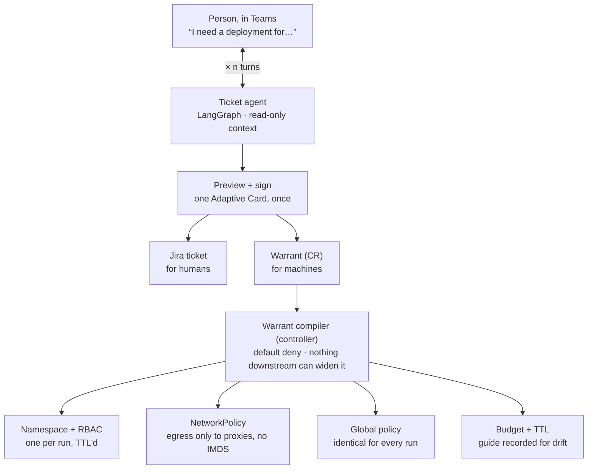
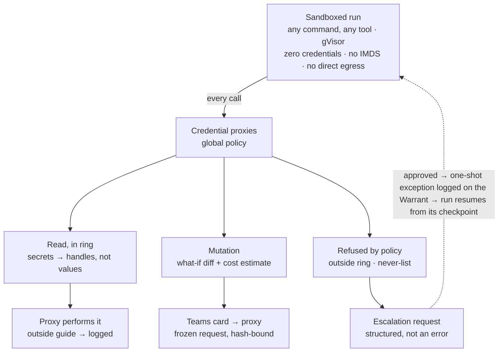
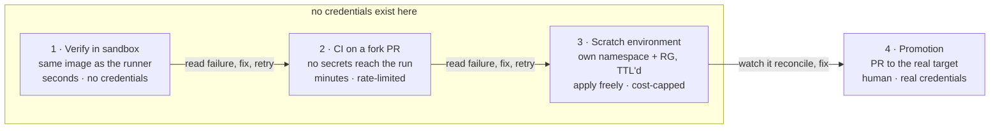

<!-- Canonical source for the design rationale. The published artifact is a
     rendered view of this file, not the other way round. -->

> **About this document.** This is the design note the project was built from — the *why*
> behind the decisions, written as an argument rather than a specification. It is addressed
> to the project's author and keeps that voice, including the second person.
>
> For *what the system does*, observably and testably, see [`specs/`](../specs/). Specs are
> normative and versioned with the code; this note is not. Where the two disagree, the specs
> win and this note needs an update.

# Scoped autonomy: chat‑to‑PR agents that never hold a credential

> A build plan for the flow that starts as a conversation, ends as a signed ticket that *is* the agent's authorization — and where a denied tool call becomes a request to a human instead of a dead run.

**Target** multi-cloud (Azure + AWS), Kubernetes · **Model** unrestricted sandbox, credentials held by proxies · **Human interface** Microsoft Teams · **Intent** internal platform, then open source

## 01 · The short answer

No product ships this loop end to end. Every *component* exists and is production-grade; the two pieces missing from all of them are the same two you circled in the notebook:

1. **A policy layer that thinks in blast radius, not in tools.** Every runtime can allowlist a tool name. None of them classify a request by what it will actually do — destroy something, cost €400 a month, return a secret — and none of them put a rendered diff in front of a human instead of a command string.
2. **The escalation path.** Every runtime can deny a call. None of them treat a denial as the start of a conversation — file a request, route to a human, log the exception, resume the run exactly where it stopped, hours later.

So: assemble the runtime from existing parts, and write the control plane that sits between the conversation and the sandbox. That control plane is your open-source project.

## 02 · What already exists, stage by stage

| Stage in your flow | Best existing option | Status |
| --- | --- | --- |
| Conversational intake | A Teams bot on Azure Bot Service / M365 Agents SDK. Plumbing is solved; OpenHands ships Jira and Slack integrations but not Teams, and none of them start from a conversation. | `partial` |
| Ticket drafting | Nothing productized. LangGraph is the right shape: one checkpointed thread per Teams conversation, `interrupt()` at the sign-off, Jira write scoped to issue creation. | `build it` |
| Policy layer | Fragments only — kagent's `requireApproval` is per tool name, agentgateway policy is per tool call, AgentCore Policy is Cedar and AWS-only. None classify by provider action, estimate cost, or render a what-if diff for the approver. | `build it` |
| Sandboxed agent in k8s | OpenHands Agent Server (v1.6.0 added Kubernetes; Enterprise uses Sysbox so agents can build images), kagent `SandboxAgent` (gVisor), or `kubernetes-sigs/agent-sandbox` — a SIG-Apps `Sandbox` CRD with gVisor/Kata via `runtimeClassName`, warm pools, pause/resume. | `ready` |
| Credential proxies | agentgateway (Rust, Linux Foundation) or IBM ContextForge as the data plane, fronting MCP servers that hold the credentials. Both do authn, audit and cost; neither ships the action-level classification or the what-if/cost card you need on top. | `partial` |
| Agent → PR | OpenHands resolver pattern (label an issue → sandbox → PR), or Claude Code / Codex driven by OpenHands as the inner agent. | `ready` |
| Command needs approval | kagent `requireApproval` (Approve/Reject, rejection reason fed back to the model), HumanLayer (Slack/email/Teams, routing, timeouts, escalation), OpenHands confirmation policy + hooks. | `ready` |
| Agent asks for more access | Nothing. Kubiya's JIT elevated permissions is closest, but it is human-initiated. A 2026 practitioner survey found 93% of agent projects still run on unscoped API keys. | `build it` |
| Infra change gate | The plan/apply split: agent runs `terraform plan` with read-only credentials, plan → JSON → OPA/Conftest, human approves the PR, a *separate* CI identity applies. Argo CD/Flux for manifests. | `ready` |

> **Why not Bedrock AgentCore**
>
> It is the strongest managed version of this control layer — Runtime, Gateway, Identity (on-behalf-of token exchange), Cedar-based Policy enforced at the gateway *outside the agent's code*, Evaluations, Harness, SOC-compliant. But it is AWS-only, and you said multi-cloud. Keep it as a reference design for the policy model; don't build your control plane on it.

## 03 · Architecture: the conversation compiles into infrastructure

It starts as a chat. Someone describes what they want in Teams, the ticket agent interviews them against real repo and platform context, and the conversation ends with a single signature that produces two artifacts: a Jira ticket for humans, and a Warrant for machines. The Warrant then compiles into a sandbox and a set of proxy policies.
Inside that sandbox the agent may run *any* command it likes. It holds no credentials and has no network route to a cloud control plane, a cluster, or a git forge except through proxies that hold the credentials themselves and decide what to do with each request. Nothing is enforced by restricting the agent's vocabulary, and the agent's prompt is not part of the security model.



**One conversation, one signature, one run built to a shared policy.** Only two of the four artifacts vary per run — the sandbox and the budget. Policy is global and identical everywhere, which is what keeps the intake conversation about the work rather than about permissions; the ticket's declared scope rides along as a guide, shaping context and giving drift a baseline, not as a fence.

### Where the credentials live

Not in the sandbox, and not in a token the agent can hold. Each privileged surface sits behind a proxy — an MCP server or a plain HTTP proxy — that owns the credential and executes the call itself:

- **Cloud proxy** holding Reader across the ring's subscriptions, and mutation identities that are only ever used to execute an already-approved, frozen request.
- **Git proxy** fronting a GitHub App installation: `contents: read` org-wide, `contents: write` and `pull_requests: write` only on the Warrant's declared repos.
- **Cluster proxy** for the Kubernetes API, read across the ring, writes as PRs.
- **Secret broker** that never returns secret material — only handles (§07).

The consequence worth planning for: every cloud action now appears in Activity Log or CloudTrail as the *proxy's* identity, not the run's. The proxy's own audit log becomes the authoritative record of which run did what, so treat it as a tamper-evident artifact with a correlation id per Warrant — not a debug convenience.

### Layer choices

- **Runtime:** kagent as the k8s-native control plane — it already models agents, tool servers, sessions and approval as CRDs, and its BYO/A2A path means OpenHands, LangGraph and Claude Code all plug in as agents rather than forks.
- **Sandbox:** `kubernetes-sigs/agent-sandbox` if you want to stay upstream (Sandbox CRD, gVisor/Kata, warm pools — note it is still pre-production as of April 2026), otherwise kagent `SandboxAgent` or OpenHands' own Sysbox-based sandboxes.
- **Coding agent:** OpenHands Agent Server headless, one sandbox per run. It already knows how to clone, edit, run tests and open a PR, and it can drive Claude Code or Codex inside if you prefer a different inner loop.
- **Enforcement:** agentgateway as the single egress, fronting the credential proxies. Every MCP tool call, every LLM call, every API call leaves through it, which is also where your audit trail and cost attribution come from for free. The global policy lives here; the per-run Warrant is policy *input*, not a separate enforcement mechanism.
- **Orchestration:** LangGraph for the intake conversation and the run's outer state machine — specifically for its checkpointer, because a chat that pauses overnight and an escalation that waits four hours for an approver must both survive pod restarts.

## 04 · The intake conversation

This is the part users will judge the system by, and the part most likely to be built badly. The failure mode is an agent that plays twenty questions: a form in a trench coat, slower than the Jira template it replaced. What makes the conversation worth having is that the agent knows things the requester doesn't — the golden paths, what the last five services in this cluster did, which constraints the platform team enforces — and brings them into the room.

### Draft first, then correct

After the opening message, the agent should take its best shot at the whole thing and show it, rather than interrogating. "Here's what I think you need: staging namespace `checkout`, base chart `platform-charts/service`, HPA 2–8, no new ingress because you'd go through the shared gateway. Two things I'm unsure about: does this need a database, and is 500m CPU right?" A human corrects a draft far faster than they answer questions. Reserve real questions for the fields the agent genuinely cannot infer — and cap them at two or three per turn.

### Read a cache, not the estate

Live reads are slow — ARM list calls across subscriptions, `kubectl` across clusters — and a conversation has a latency budget of seconds, not a minute. So most of what the agent needs should come from a **periodically refreshed inventory**: which services exist where, which charts and versions are in use, which namespaces and resource groups are taken, what recent tickets touched the same area. Query that instantly, and go to the live API only to confirm something specific the draft turns on.

If you already run Backstage or Port, that inventory exists and this is a plugin. If not, a nightly job writing a flat index is enough to start, and it stays useful well beyond this project — the reason intake feels magic is that the agent knows the estate, and the reason it feels sluggish is that it goes and asks.

### State: one thread, one graph

Map the Teams conversation id to a LangGraph `thread_id` with a durable checkpointer. That gives you three things for free: the conversation can pause overnight and resume, the draft is inspectable at any point, and a second person joining the thread sees the same state. The graph's state schema *is* the ticket draft — goal, in scope, out of scope, constraints, acceptance criteria, plus what the person expects it to touch — and each turn is a node that fills or revises slots. Render the current draft as an Adaptive Card that updates in place, so the person can always see what's filled and what's still open without re-reading the thread.

### What the agent may touch during intake

Everything it can read, and nothing it can change. The ticket agent needs **repositories and live infrastructure**, because that is where the difference between a vague ticket and a good one comes from: the `checkout` namespace already exists in `staging-eu`, the neighbouring service is on `platform-charts` v2.3, `rg-checkout-stg` already has a Postgres flexible server, and the cluster doesn't have the CRD the obvious approach would need. None of that is knowable from the conversation, and all of it changes what the ticket should say. The best outcome an intake agent can produce is sometimes "this already exists" or "this is a platform change, not a service change" — and it can only reach those by looking.

Mechanically this needs no new machinery: it's the same read path through the same proxies, with the same rules. What differs is the profile, and this is the first place per-agent policy genuinely earns its keep (§05.1):

- **Reads: possibly wider than the coding agent's.** Someone may open a conversation about production, and reading prod state to write a good ticket is legitimate even when no coding agent will ever touch prod. Read ring and mutation power are separate dials; this agent turns one up and the other off.
- **Mutations: none at all.** Not gated, not scratch — absent. There is no request this agent can make that a human should be asked to approve.
- **Writes: exactly one.** Create a Jira issue. That's the entire surface.

> **Two things that get sharper here**
>
> **Secrets in chat are worse than secrets in a container.** This agent's output lands in a Teams thread that persists, gets searched, and gets screenshotted. The deny-and-handle rules from §07 apply unchanged, plus one more: summarise what it read, never paste raw resource dumps into the conversation.
>
> **The injection surface widens.** Reading live infrastructure means reading resource tags, descriptions, annotations and ConfigMaps — text that far more people can write than can write to a repo. And this agent's output is a proposal a human is about to sign. The defence is the one already in place, which is why it matters that it stays in place: the agent drafts, the human signs, the policy bounds.

### The stop condition

The conversation ends at a single sign-off, not a drip of small approvals. The agent posts a preview card with the ticket on one side and the proposed scope on the other — *this is what I'll be able to change* — and the person hits Create, Edit, or Cancel. That click is the signature: it creates the Jira issue and the Warrant in one transaction, records the signer's Entra identity, and is checked against the team's ceiling before anything is written. If the requester's ceiling doesn't cover it, the card routes to someone whose does, with the delta highlighted.

Notice what the interview *doesn't* have to do: negotiate permissions. Because policy is global (§05), the conversation is about the work — goal, constraints, what done looks like, and roughly what the person expects to be touched. That last part is recorded as the guide, and being wrong about it costs nothing: it shapes the agent's first draft and gives drift a baseline, and that's all. An intake conversation that interrogates someone about subscriptions and repo lists is a permissions form wearing a chat interface.

> **Design rule**
>
> The agent drafts, the human signs, the global policy bounds. Keep those three separable and the prompt-injection question stays boring — the worst a poisoned context can do is propose something a human then has to knowingly approve, within limits they cannot exceed anyway.

### Escape hatches worth building early

- **"Just file it."** Sometimes the person knows exactly what they want. One turn, no interview, empty guide.
- **Start from an existing service.** "Like `orders-api` but for checkout" is the most common real request and should short-circuit most of the interview.
- **Amend before pickup.** Until a run claims the Warrant, re-opening the thread should let the person revise the ticket rather than filing a second one.

## 05 · The Warrant

Names are provisional, but the metaphor is worth keeping: a warrant is a signed, time-bound, scope-limited authorization issued by someone with the standing to issue it. No warrant, no run.

In v1 the Warrant does not enforce anything by itself. The enforcing layer is a **global policy**, shared by every run; the Warrant carries intent, budget, approvers and the audit anchor, plus a *guide* that shapes the agent's context and gives drift something to be measured against. Per-ticket enforcement is a later axis (§05.1), and the drift data you collect now is what makes it writable then.

Two objects, then. The global one does the work:

```yaml
apiVersion: warrant.dev/v1alpha1
kind: GlobalPolicy
metadata: { name: platform-nonprod }
spec:
  ring:                                # hard outer bound — reads stop here
    github:   { org: acme }
    azure:    { tenant: 8f1e..., managementGroup: mg-platform-nonprod }
    aws:      { orgUnit: ou-nonprod }
    clusters: [staging-eu, staging-us]

  reads:
    allow: "*"                          # anything in the ring, no ticket needed
    deny:                              # returned as handles, never as values
      - Microsoft.KeyVault/vaults/secrets/*
      - Microsoft.Storage/storageAccounts/listKeys/*
      - k8s:core/v1/secrets
      - "**/*.tfstate"
    mask: { entropy: high, patterns: [pem, jwt, connstring] }   # backstop

  mutations:
    classify: byAction                 # provider action name, not HTTP verb
    gate: [destructive, costsMoney, dataActions]   # → human, with what-if diff
    never: ["*/roleAssignments/*", "prod/*"]
    execute: proxy                     # frozen request, hash-bound

  pullRequests:
    repos: anyInRing                   # a PR is a proposal; review is the gate
    from: fork                         # see the CI note below
    label: [agent-authored]
    rateLimit: 5/run
```

And the per-run one mostly describes rather than restricts:

```yaml
apiVersion: warrant.dev/v1alpha1
kind: Warrant
metadata: { name: plat-2417-checkout-deploy }
spec:
  ticketRef: { provider: jira, key: PLAT-2417 }      # audit anchor
  policyRef: platform-nonprod                       # what actually enforces

  intent:
    goal: "Deployment + Service + HPA for checkout-api in staging"
    constraints: ["reuse platform-charts base", "no new CRDs"]
    acceptance:  ["kustomize build passes", "conftest suite green"]

  guide:                                # advisory: primes context, baselines drift
    expectedReads:   [acme/platform-manifests, acme/checkout-api]
    expectedTargets: ["clusters/staging/checkout-api/**"]
    outOfScope:      ["shared ingress", "anything in prod"]   # prose → the card
    driftPolicy: annotate                            # log | annotate | notify
    anomaly: { distinctRepos: 40, apiCallsPerMin: 300 }

  budget: { tokens: 2_000_000, wallclock: 45m, usd: 12, cloudMonthly: 250 }
  ttl: 4h
  approvals: { channel: msteams, approvers: ["group:platform-oncall"] }
  signature:
    by: "aad:8c31-..."  at: "2026-08-13T09:14:22Z"  ceiling: platform-team
```

> **Why a PR needs no boundary**
>
> A pull request changes nothing until someone merges it. The repo's reviewers and CODEOWNERS are already the right gate, enforced by the forge rather than by us, and a second boundary in front of them buys nothing but friction. An agent that opens a PR against a repo nobody expected has produced a proposal that gets closed in ten seconds — an agent that *can't* has produced a stalled run and a permission request that would have been approved anyway.

> **The one exception worth engineering**
>
> Pushing a branch to a repo can execute code in that repo's CI — the workflow file travels with the branch, so the agent's edited copy is what runs, before review. That isn't a proposal; that's code execution under the repo's identity, with its secrets. So the agent always **pushes to a fork**, where no repository secret reaches the run and the token cannot elevate — a property you can check in one field rather than infer from a fleet-wide inventory (§08).

Three properties still make the Warrant more than a config file:

- **An append-only exception log.** With global policy doing the enforcing, an approval is not a widening of scope — it is a one-shot grant for a single frozen request, appended to the Warrant with the approver's identity. The log is the audit story: "who let this run delete rg-checkout-stg, at 16:40, against which diff."
- **Bounded by a ceiling.** A `WarrantCeiling` per team caps what any approver may grant, so an on-call engineer approving an exception cannot exceed their own team's authority. This is what stops the approval card from being a social-engineering surface.
- **Attenuable, never widenable, in flight.** If a run spawns sub-agents, they present a run identity derived from the parent's that the proxy can only ever read as narrower — the Biscuit/macaroon pattern the IETF's attenuating-agent-token drafts are converging on. A sub-agent cannot recover scope its parent dropped, and neither holds a credential either way.

### 05.1 · Later: per-agent and per-ticket policy

One global policy is the right starting point — one thing to reason about, one thing to audit, and no per-ticket authoring burden on the intake conversation. It has one structural weakness, and it is worth naming now so the schema leaves room for the fix: a global policy can only answer *"is this operation dangerous?"*, never *"is this operation expected here?"* Which means every dangerous operation goes to a human, forever, at whatever volume the fleet generates. That is survivable at one team and not at ten.

The eventual fix is not more restriction, it is **selective auto-approval** — and it needs two axes the global policy doesn't have:

- **Per-agent trust.** Agents are not interchangeable, and the two you already have prove it: the intake agent reads broadly — possibly including production — and mutates nothing, ever; the coding agent reads narrowly and mutates freely inside a scratch environment. Neither profile is a subset of the other, so a single global policy has to be the union of both, which is strictly more permission than either needs. Read scope and mutation power are separate dials, and modelling them per agent identity is the difference between least privilege and a shared service account with extra steps.
- **Per-ticket expectation.** The `guide` block is already collecting this: what the ticket said it would touch, versus what the run actually touched. Once you have a few hundred runs of that, "create in `rg-*-stg` under €50/month when the ticket declared that resource group" becomes a rule you can write with evidence instead of nerve — and the human gate goes back to being rare enough that people read it.

So: global policy enforces, the guide observes, and the observations are what make per-ticket policy authorable later. Ship the first, instrument the second, and don't write the third until the data tells you what it should say.

## 06 · Inside a run: three exits, one loop

The agent can run anything. It just can't reach anything directly — every privileged call lands on a proxy that holds the credential, classifies the request against the global policy and the Warrant, and either performs it, gates it, or refuses. The interesting one is refuses.



**A denial is a message, not a crash.** The proxy returns a structured refusal — `{denied, reason, escalation_id}` — so the agent can file a request and park instead of hallucinating a workaround. That structured deny is the single most important interface in the design; a bare 403 gives the model nothing to reason about and it will try to route around you. Note what is *not* on this diagram: a path where the agent holds a credential.

### The escalation state machine

1. Proxy refuses → emits an `EscalationRequest` CR referencing the Warrant, the frozen request, and the model's own justification.
2. Run checkpoints and the sandbox is *paused*, not destroyed (agent-sandbox pause/resume, or a LangGraph checkpointer + fresh pod on resume).
3. Teams card to the approver group. Timeout auto-denies — an escalation that nobody answers must not hold a namespace and a credential open.
4. Approve → new Warrant revision (validated against the ceiling) → compiler re-renders RBAC/NetworkPolicy/gateway policy → run resumes with the delta injected as context.
5. Every step appended to the Jira ticket, so the ticket ends up being the complete record of what the agent was allowed to do and who allowed it.

## 07 · The policy layer in practice

### Classify by action, never by verb or by binary

Two traps. The first is gating the CLI: wrap `az` and the agent writes ten lines of Python against `management.azure.com` — not maliciously, just because that's a reasonable way to do the job. Interception has to sit at the API boundary, which is why the sandbox's only route out is the proxy.

The second is using the HTTP verb as the danger signal. ARM is POST-for-everything: `…/deallocate` tears down a VM, a PUT on a tag does nothing. Classify on **provider action name + target scope + cost** instead — `Microsoft.Compute/virtualMachines/delete`, `ec2:TerminateInstances`. Those taxonomies already separate read from write from action, and Azure flags `dataActions` separately, which is precisely the sensitive-read axis you need. You get a policy that is per-provider but not per-tool, and it survives the agent inventing a new way to make the call.

### Approve a diff, not a command

Never put a command on the approval card. Run the provider's own dry-run — `az deployment what-if`, `terraform plan`, `kubectl --dry-run=server` — and show the resulting diff with an Infracost estimate attached. "Creates 3 D4s_v5 in rg-checkout-stg, ~€412/mo, deletes nothing" is a decision a tired on-call engineer can make correctly at 16:40. `az vm create --size Standard_D4s_v5 …` is not; they approve it anyway, which is worse than not asking.

Then bind the approval to a **frozen request**: hash the exact request object, and have the proxy execute that object itself. Never hand an approval token back to the agent — otherwise arguments can change between "approve" and "execute", and your gate is a suggestion.

### Deny secrets, don't mask them — and return handles

Masking is the wrong default for the known-sensitive set: Key Vault secrets, storage account keys, connection strings embedded in resource properties, `kubectl get secret`, terraform state. Regex and entropy masking is your backstop for the long tail, not your policy.

**Nor is refusal the right default, which is a correction to an earlier version of this note.** Refusing the read tells the agent nothing about the shape of what exists — it cannot tell a secret it may not read from one that is simply absent, and it cannot discover that the wiring it was asked to create is already there. Perform the read and substitute: return the resource with every secret-valued field replaced by a handle, structure and non-secret fields intact. `kubectl get secret` comes back with its key names and `{{secret:…}}` in place of each value. The agent learns everything it legitimately needs and still never sees a byte. The security property never rested on refusal; it rests on the proxy holding the credential and resolving handles outbound only, into fields that cannot echo them back. See [`specs/0001-proxy-protocol`](../specs/0001-proxy-protocol/spec.md) `PRX-R-055`.

And when the agent legitimately needs a secret in order to *wire something up*, returning `****` just makes it loop trying to work out what went wrong. Return a handle instead — `{{secret:kv-prod/db-password}}` — that the proxy resolves at call time. The agent composes with it, writes it into a manifest, passes it to another tool, and never sees the value. Every mask you do emit is worth logging: it usually means the ring is wrong, not that the agent misbehaved.

### What is soft, and what is hard

Only two things are hard: the ring, and the never-list. Everything else the agent proposes rather than performs.

- **Reads inside the ring: soft.** Discovering mid-task that it needs `terraform-modules` is the system working. A permission request there is approved every time, which makes it a queue with no signal in it. Log the drift, annotate the ticket, and let the pattern teach you what the guide should have said.
- **Pull requests: soft, anywhere in the ring.** Review is the gate that already exists. Rate-limit them, label them, push from a fork, and let reviewers close the ones that shouldn't have been opened.
- **Mutations in the scratch ring: free.** A per-run namespace and resource group that dies with the Warrant. Apply, break, retry, no approval — this is what makes the feedback loop in §08 possible at all.
- **Live mutations anywhere else: gated, every time.** Not by scope but by the action classifier — destructive, costs money, or touches data. The card carries the what-if diff; the proxy executes the frozen request.
- **Ring and never-list: hard.** Outside the ring, or on the never-list (IAM, prod), the proxy refuses and the run files an escalation.

Watch aggregates even when each call is fine. Four hundred repos read by one run is a signal regardless of how allowable each read was — that's what the anomaly thresholds are for, and they matter more once nothing else is stopping reads.

### Still keep the plan/apply split

"Approved" must never mean the agent now holds apply rights — it means the proxy will execute one frozen request under a different identity. For infrastructure that's the classic split: the agent plans against read-only credentials, the plan JSON goes through Conftest/OPA, the card shows the policy verdict beside the diff, and a separate service principal applies the saved plan. For Kubernetes the equivalent is a manifest PR that Argo CD reconciles after merge.

> **The gap most people miss**
>
> A PR that edits CI configuration is not an ordinary PR — `.github/workflows/**`, Argo `Application` specs and Atlantis config are proposals to change what your automation is allowed to do, and a distracted reviewer approves them at the same rate as a README fix. CODEOWNERS on those paths, so the person who understands the consequence is the person who has to click. This is the review-is-the-gate model working as intended: put the right human in front of the right diff rather than adding a boundary the agent has to ask permission to cross.

### Teams: build a bot, not a webhook

Office 365 connectors in Teams are being retired (deadline extended to 30 April 2026), and MessageCards can't carry the interactive inputs you need anyway. For approvals you want an Azure Bot Service / Microsoft 365 Agents SDK bot that can proactively message a channel and render Adaptive Cards with `Action.Execute`. Two rules:

- **Trust the activity, not the card.** Authorize the approver from the verified `from.aadObjectId` on the bot activity and a live Entra group-membership check — never from a field in the card payload, which is client-supplied.
- **Bind the card to a revision.** The card approves Warrant revision *N*; if the run has moved on, the approval is stale and must be re-requested. Otherwise an approver clicks yes on a diff that no longer exists.

Power Automate Workflows covers simple "post a status" messages if you want something running this week, but the approval path should be the bot.

### Sandbox hygiene: the four things that make "run anything" safe

Letting the agent run arbitrary commands is only sound if the sandbox has genuinely nothing to steal and nowhere to go. All four of these, or none of it holds:

- **No projected service account token** — `automountServiceAccountToken: false`. Otherwise the agent talks to the API server directly and your cluster proxy is decorative.
- **No reachable IMDS.** Block `169.254.169.254` and the link-local range. This is the classic escape: one curl gets you the node's cloud identity, which is invariably more privileged than the run.
- **Egress default-deny** to everything except the proxies. Package installs go through an internal mirror, also proxied. Without this the agent can reach `management.azure.com` the moment it finds any credential anywhere.
- **No node identity worth having.** Run agent sandboxes on a node pool whose managed identity or instance profile grants nothing, so IMDS being reachable through a bug is boring rather than fatal.

The sandbox still authenticates to the proxies — SPIFFE mTLS from SPIRE is the clean way, and it gives the proxy a verified run identity to bind its audit log and rate limits to. The difference from the earlier design is that this identity buys *nothing* outside the proxy: there is no exchange into an Azure or AWS token, so a leaked sandbox is worth exactly one authenticated conversation with a policy engine.

> **The proxies are now the crown jewels**
>
> They hold real credentials for every environment in the ring, so they inherit the security posture the sandbox shed: reachable only from sandbox namespaces, per-run identity required on every call, rate-limited, and with their own change control. Worth being explicit about in the threat model, because this design does not remove that risk — it concentrates it somewhere you can actually watch.

## 08 · The CI feedback loop

An agent that can't run anything writes plausible YAML. The loop — run it, read the failure, fix it, run it again — is most of what separates a useful agent from an expensive autocomplete, so this has to work, and it has to work in seconds rather than minutes.

The reason it feels dangerous is a naming collision. Two different things are called CI:

- **Verification** — build, unit tests, lint, `kustomize build`, `terraform plan`, `conftest`, image build. Needs source, a package mirror, maybe a registry pull. Needs no production credential of any kind.
- **Delivery** — publish, sign, deploy, apply, sync, notify. Needs real credentials, and is exactly what the human gate exists for.

The agent needs the first in a tight loop and must never trigger the second. Most repos fuse them into one workflow file, which is the actual problem — not the agent. Splitting them is hygiene you want regardless; the agent just makes it urgent.



*Cost per iteration increases left to right.*

**Three loops, and only the last one costs anything to get wrong.** Push work leftward: the agent should reach loop 2 only when loop 1 is green, and loop 3 only when it needs to see something actually reconcile. Using CI as a compiler is the failure mode — it burns runner minutes, floods the queue, and makes each iteration ten times slower than it needs to be.

### Loop 1 · verification in the sandbox

The agent already has the repo and a container. Run the verification steps there — a repo-declared `verify` entrypoint if you can standardise one, otherwise `act` or Dagger to execute the workflow definition locally. Seconds, no queue, no credentials, no PR noise, and the failure output lands directly in context. Make the sandbox image the *same image the runners use*, or you will spend the year debugging "green locally, red in CI".

### Loop 2 · real CI, and the pipeline the agent can rewrite

Here is the sharp edge, and it is worth understanding exactly rather than working around. **The workflow file travels with the branch.** On a `pull_request` trigger from a same-repo branch, the workflow that executes is the one on the PR branch — the agent's edited copy — not the one on main. Review gates the merge; it does not gate the run. So an agent can edit `.github/workflows/test.yml`, push, and have its version execute before any human has looked at it.

In a same-repo PR that execution comes with real capability: repository and organization **secrets** available to the job, `id-token: write` exchanging for a live **cloud role** via a trust policy that matches the branch, a `GITHUB_TOKEN` at whatever the org default is, and — if the job lands on a **self-hosted runner** — arbitrary code on your infrastructure under the runner node's identity. Any one of those hands the agent a credential, which is the one thing the entire design exists to prevent.

> **It doesn't take a malicious agent**
>
> "The integration tests fail because they can't reach the database — I'll add `secrets.DB_PASSWORD` to the test job" is a completely reasonable-looking thing for a helpful agent to do, and it silently converts a credential-free verification job into a credential-bearing one. Plan for the helpful failure, not the adversarial one; it is far more likely and looks like progress right up until it isn't.

Note what the real property is. A pipeline is deterministic *given its definition* — but the definition is an input the agent controls. What you need is not determinism; it is that **the pipeline definition and the credentials are under separate control**.

### Why the fork wins: the invariant you can actually check

In principle you could keep same-repo branches and make the workflow worthless to hijack — no secrets in verification jobs, no `id-token: write`, read-only default token, hosted runners. The invariant would be: *executing a workflow the agent authored grants it nothing it doesn't already have in its sandbox*. Sound, and it removes the fork's friction.

It fails on **verifiability**, and OIDC is the clean example. The trust relationship does not live in the repository — it lives on the cloud side, in an Azure federated identity credential or an AWS role trust policy that names `repo:acme/checkout-api:ref:refs/heads/*`. Scanning the repo tells you which workflows currently *use* OIDC. It cannot tell you which cloud roles would *accept* one, and the agent can add the two lines that use it. To answer the real question you would have to enumerate every federated credential on every managed identity and app registration across every subscription in every tenant, plus every IAM role trust policy naming the GitHub provider, reverse-index the lot by repository, and then keep it current — while anyone with Contributor on a resource group can add a new one this afternoon.

> **The principle**
>
> Prefer a control you can verify locally and in constant time over one that requires a fleet-wide inventory to be complete and current. "Is this a fork PR?" is one field on the run. "Does any cloud role anywhere trust this repository?" is a question your estate cannot answer honestly, and a control resting on an answer you can't check is a control you don't have.

The fork gives the property structurally: no repository secrets reach the run, the token is read-only, and the job cannot elevate itself into an OIDC exchange. It holds no matter what someone attached to a subscription last week, and no matter what the workflow file says — which is exactly the guarantee you want when the workflow file is agent-authored.

### What survives the fork, and what it costs

The fork closes the credential problem. It does not close the **runner** problem: a fork PR landing on a self-hosted runner is still arbitrary agent-authored code executing on your infrastructure, under whatever identity that node carries. That check stays load-bearing, so it belongs in policy rather than in a scan:

```yaml
  pullRequests:
    from: fork                             # always
    requireRunner: ephemeral-hosted        # never self-hosted, no exceptions
    rateLimit: 5/run
```

Two prerequisites worth checking before week one: forking private repositories has to be enabled for the org (restricted to members), and the agent needs a bot account with a persistent fork per repository, kept in sync. Then plan for the friction rather than discovering it — cross-fork PRs make it awkward for a human to push a quick fix onto the agent's branch, so enable "allow edits by maintainers" on every agent PR and have a documented path for a person to adopt the branch into origin and take over.

Where verification genuinely needs a credential — a private base image, an internal package mirror — inject a narrow purpose-built one from your runner configuration rather than exposing the repo's secrets. Read-only pull, nothing else, one org decision.

### The scan still earns its keep

It just stops being the gate. Run it as a hygiene report over the estate — it finds the things the fork doesn't fix, and the things that were wrong before any agent existed:

```yaml
  ciHygiene:                            # report, not a gate
    critical:
      - runs-on: self-hosted reachable from a PR trigger
      - pull_request_target + checkout of PR head
    warn:
      - permissions: absent, or write by default
      - deploy job without environment:
      - verification job referencing secrets.*
```

The last one is the interesting signal: a test job that needs a secret is usually a test that should be using a fixture, and it's the reason the agent's loop will stall on that repo. Fix it because the tests are better afterwards, not because a policy demanded it.

The agent reads results back through the proxy — `gh run view --log-failed` — and iterates.

### Loop 3 · a scratch environment, where mutations are free

This is the piece the design was missing, and it matters most for exactly the work in your notebook. "Create a deployment for a new service" isn't verifiable by a unit test — you need to watch pods come up and crashloop. So the mutation gate shouldn't be binary. Add a **scratch ring** to the global policy: a per-run namespace and resource group, created with the Warrant, destroyed with it, cost-capped and TTL'd.

```yaml
  mutations:
    scratch:                                   # disposable by construction
      namespaces: ["agent-run-*"]
      resourceGroups: ["rg-agent-run-*"]
      gate: none                             # apply, break, retry, freely
      ttl: 4h
      costCeiling: { monthly: 50, currency: EUR }
    gate: [destructive, costsMoney, dataActions]   # everywhere else
```

Inside the scratch ring the agent applies whatever it likes without asking, because the blast radius is a thing that will be deleted in four hours either way. Promotion to a real staging namespace stays a PR. This is also the honest answer to "how does the agent know it worked" — it watched it work, in an environment where being wrong was free.

### Reading the logs is a read, with everything that implies

CI logs leak secrets constantly — echoed environment, verbose curl, a test fixture printing a connection string. Route log retrieval through the same proxy and the same rules as any other read: known-sensitive patterns denied, entropy masking as the backstop, handles where the agent needs to *use* a value it shouldn't see. It would be a bad joke to build all of §07 and then hand the agent a secret through a build log.

## 09 · Build order

One global policy makes this shorter than it was. Nothing needs a per-ticket permission model, so the intake chat can ship early on its own merits — people will use a chat that writes a good ticket even if no agent ever picks it up. It also pulls the read proxy forward: intake needs it first, and the coding agent inherits a path that has already been exercised by something with no mutation power at all. What takes the time after that is taking credentials away from the coding agent without breaking it, and building the classifier that decides what deserves a human.

**Weeks 1–2 — Chat → ticket, and one run**  
Teams bot + LangGraph intake, reading the estate through a first read-only proxy and an inventory index, filing a Jira issue. Separately: OpenHands turning that issue into a fork PR, verifying in-sandbox against the runner image.

**Weeks 3–6 — Take the credentials away**  
Cloud and git proxies holding the tokens; sandbox stripped of SA token, IMDS and egress. Scratch ring so the agent can still apply and observe. Everything auto-approved — the goal is that nothing breaks when the agent stops holding keys.

**Weeks 7–10 — Make approval real**  
Mutations gated: what-if diff + cost on an Adaptive Card, Entra group check, frozen request executed by the proxy. Secret handles instead of masking. Plan/apply split for infra.

**Weeks 11–14 — Close the loop**  
Ring boundary + deny list, structured refusals, `EscalationRequest`, pause/resume from checkpoint, timeout auto-deny, drift annotations on the ticket. This is the differentiating piece.

**Weeks 15–18 — Learn from the drift**  
Report on guide-vs-actual across real runs. This is the input for per-agent trust levels and the first auto-approval rules (§05.1) — written with evidence rather than nerve.

### 09.1 · Local development, at zero cost

This doubles as the contributor setup: someone should be able to clone the repo and run the entire loop on a laptop, offline, without an account anywhere. The design makes that unusually achievable — the agent holds no credentials and reaches nothing directly, so the expensive parts are all at the edges and can be stubbed or swapped.

| Component | Free substitute |
| --- | --- |
| Cluster | k3s or kind locally; gVisor via `RuntimeClass`; the `agent-sandbox` CRD installs fine on either |
| Coding agent | OpenHands, self-hosted |
| Proxies | agentgateway or ContextForge — both OSS, both run locally |
| Run identity | SPIRE; Vault OSS or OpenBao for the secret broker |
| Tickets | GitHub Issues behind the ticket adapter; Jira is a later implementation of the same interface |
| Repos + CI | Public repos get unlimited hosted Actions minutes; private free tier is 2,000/month |
| Loop 1 | `act`, or just running the verification steps in the sandbox — free by construction |
| Approvals | A local CLI + single-page adapter. Teams is one implementation of the channel interface, not the interface |
| Inventory | A nightly script writing flat JSON, until there's a Backstage to plug into |
| Observability | OTel with Jaeger or Grafana |

### The three things that genuinely cost money

- **Inference.** The only recurring cost, and the one to design around rather than shop for. Route every model call through a gateway (LiteLLM) so the model is configuration: free hosted tiers rotate constantly, and per-role model choice plus hard spend caps are worth having regardless. Local models via Ollama are fine for plumbing work and weak on long agentic loops — good enough to develop against, not to judge the system by.
- **Cloud actions.** Don't start with cloud at all. A local k3s is a complete mutation surface — create, scale, delete, genuinely destructive operations worth classifying — and the scratch ring becomes a namespace on your laptop. LocalStack covers AWS shapes. Azure has no real ARM emulator, but reads, resource-group and tag operations, and `az deployment what-if` are free, so a credit-funded subscription lasts indefinitely if you stay off billable resources. Build the cloud proxy after the Kubernetes one works.
- **Teams.** The bot is free — Azure Bot Service F0 allows unlimited messages on standard channels, and Teams is one. The constraint is the tenant: the M365 Developer Program E5 sandbox now requires a Visual Studio Professional or Enterprise subscription, or partner-program membership. Either sideload a dev app into a company tenant, or build against the local approval adapter and implement Teams once you have somewhere to install it.

> **The decision that keeps it cheap forever**
>
> Most of this system should never call a model. The action classifier is a lookup table; the CI hygiene scan is static analysis; the diff comes from the provider's what-if; the cost estimate comes from Infracost. Only the intake conversation and the coding loop need inference at all. That is cheaper at runtime and better engineering besides — deterministic, unit-testable, reviewable in a PR, and identical on every run.

**The zero-spend milestone:** local approval adapter → GitHub Issue → OpenHands in a gVisor sandbox on k3s → fork PR on a public repo → free Actions CI → a scratch namespace it can break freely → approval card → merge. That exercises every mechanism in this document and is enough to publish the repository. Teams and the cloud proxies are adapters added afterwards, by which point the core is real.

## 10 · What the open-source project should and shouldn't be

The crowded lanes are agent runtimes, MCP gateways, and coding agents — kagent, agentgateway, ContextForge, OpenHands, agent-sandbox all have real momentum and funding behind them. Competing there is a losing trade. The empty lane is *the authorization lifecycle of an agent run*.

- **Ship:** the GlobalPolicy/Warrant/EscalationRequest CRDs, the action classifier (provider action name → destructive? costs money? sensitive read?), the what-if-plus-cost approval card, secret handles, the escalation loop, and the audit and drift export. A controller, a policy pack, and two channel adapters — small enough for one maintainer to hold.
- **Depend on:** agentgateway or ContextForge as the data plane, agent-sandbox or kagent for isolation, OpenHands or Claude Code for the work, SPIRE for run identity, Infracost and the providers' own what-if APIs for the diffs.
- **The classifier is the moat.** A curated, versioned mapping of cloud action names to blast radius and cost is tedious to build, valuable to everyone, and exactly the kind of artifact that accretes contributors — it is the CVE database of agent operations. Nothing like it exists in the open today.
- **The CI hygiene scan is the wedge.** It's useful standalone, needs none of the rest of the system, and answers a question every platform team now has: where in our estate can agent-authored code reach a credential or a self-hosted runner? Shipping that alone would earn the project users, and every one of them arrives with a reason to want the rest.
- **Positioning:** "Terraform for agent permissions" — the grant is a reviewed, versioned, signed artifact, and the run cannot exceed it. That framing lands with the platform and security teams who are currently blocking agent rollouts, and it's a story nothing on the market tells today.
- **Interop:** emit Cedar for AgentCore users and OPA/Rego for everyone else from the same policy source. Being the source of truth that compiles *down* to whichever policy engine a shop already runs is a much stronger position than being another policy engine.

### Known hard problems — worth naming in the README

- **Prompt injection through the ticket.** The ticket is untrusted text that proposes permissions. This is exactly why a human signature — not the refinement agent — creates the Warrant, and why ceilings exist.
- **Approval fatigue.** If every run generates six cards, people rubber-stamp. HumanLayer's learned auto-approvals are one answer; a classifier that only gates what genuinely deserves it is a better one.
- **Enforcement bypass.** Anything that lets the agent reach an API outside the proxy path — a reachable IMDS, a projected service account token, a self-hosted runner picking up a fork PR (§08), a package that phones home — defeats the whole model. Assume the agent is untrusted and prove the path is the only one.
- **Soft scope drifting into no scope.** Guided reads and unrestricted PRs are the right calls, but they lean the entire weight of the design on two things actually working: the ring being a real boundary, and the anomaly thresholds actually firing. Otherwise "scope is a guide" quietly becomes "there is no scope", and the first prompt-injected run enumerates the estate at its leisure.
- **Global-only policy at ten teams.** It answers "is this dangerous", never "is this expected here", so approval volume scales with the fleet and nothing auto-approves. Fine now, structurally limiting later — which is what §05.1 exists to keep the door open for.
- **Escalation as an attack.** An agent that has learned it can get more scope by asking will ask. Ceilings, revision diffs shown to approvers, and rate-limited escalations per Warrant.

---

Sources

- [kagent docs](https://kagent.dev/docs/kagent/) · [HITL / requireApproval](https://kagent.dev/docs/kagent/examples/human-in-the-loop) · [agent types & BYO](https://www.kagent.dev/docs/kagent/concepts/agents/) · [Solo.io kagent](https://www.solo.io/products/kagent)
- [OpenHands docs](https://docs.openhands.dev/) · [Kubernetes install](https://docs.openhands.dev/enterprise/k8s-install.md) · [security & action confirmation](https://docs.openhands.dev/openhands/usage/security/security.md) · [enterprise](https://www.openhands.dev/enterprise)
- [LangGraph interrupts](https://docs.langchain.com/oss/python/langgraph/interrupts)
- [Bedrock AgentCore release notes](https://docs.aws.amazon.com/bedrock-agentcore/latest/devguide/release-notes.html) · [AgentCore Policy](https://docs.aws.amazon.com/bedrock-agentcore/latest/devguide/policy.html)
- [kubernetes-sigs/agent-sandbox](https://github.com/kubernetes-sigs/agent-sandbox) · [docs](https://agent-sandbox.sigs.k8s.io/docs/) · [production notes](https://northflank.com/blog/agent-sandbox-on-kubernetes)
- [IBM ContextForge](https://github.com/IBM/mcp-context-forge) · [agentgateway](https://www.solo.io/blog/five-minutes-to-your-first-mcp-server-tool-a-quickstart-with-agentgateway)
- [O365 connector retirement](https://devblogs.microsoft.com/microsoft365dev/retirement-of-office-365-connectors-within-microsoft-teams/) · [Teams approval bots](https://learn.microsoft.com/en-us/answers/questions/5705984/custom-microsoft-teams-bot-for-approval-workflows)
- [IETF: attenuating authorization tokens for agentic delegation](https://datatracker.ietf.org/doc/draft-niyikiza-oauth-attenuating-agent-tokens/) · [SPIFFE for agents](https://riptides.io/blog/how-to-deliver-spiffe-identity-to-ai-agents/)
- [Least privilege for kubectl/terraform agents](https://kodekloud.com/blog/least-privilege-for-ai-agents-securing-kubectl-terraform-and-cloud-clis/) · [Kubiya JIT permissions](https://www.kubiya.ai/blog/internal-developer-platforms-and-conversational-ai) · [HumanLayer](https://ycombinator.com/launches/M8e-humanlayer-human-in-the-loop-for-ai-agents-and-beyond)
